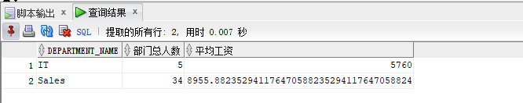

# 实验1： SQL语句的执行计划分析与优化指导

## 1. 实验目的

分析SQL执行计划，执行SQL语句的优化指导。理解分析SQL语句的执行计划的重要作用。

## 2. 实验内容

（1）对Oracle12c中的HR人力资源管理系统中的表进行查询与分析。

（2）首先运行和分析教材中的样例：本训练任务目的是查询两个部门('IT'和'Sales')的部门总人数和平均工资，以下两个查询的结果是一样的。但效率不相同。

（3）设计自己的查询语句，并作相应的分析，查询语句不能太简单。

## 3. 实验步骤

教材查询语句一:

```sql
set autotrace on

SELECT d.department_name,count(e.job_id)as "部门总人数",
avg(e.salary)as "平均工资"
from hr.departments d,hr.employees e
where d.department_id = e.department_id
and d.department_name in ('IT','Sales')
GROUP BY d.department_name;
```


教材查询语句二：

```sql
set autotrace on

SELECT d.department_name,count(e.job_id)as "部门总人数",
avg(e.salary)as "平均工资"
FROM hr.departments d,hr.employees e
WHERE d.department_id = e.department_id
GROUP BY d.department_name
HAVING d.department_name in ('IT','Sales');
```




第一条语句是最优的，

SQL Developer优化指导：


自己设计的查询语句：

```sql
create unique index index_name
on hr.departments(department_name);
select d.department_name,count(e.job_id) as "部门总人数", avg(e.salary) as "平均工资"
from hr.departments d,hr.employees e
where d.department_id = e.department_id
and d.department_name in ('IT','Sales')
group by d.department_name;
drop index index_name;
```

## 4. 实验总结

​		mysql以表级锁为主，对资源锁定的粒度很大，如果一个session对一个表加锁时间过长，会让其他session无法更新此表中的数据。虽然InnoDB引擎的表可以用行级锁，但这个行级锁的机制依赖于表的索引，如果表没有索引，或者sql语句没有使用索引，那么仍然使用表级锁。oracle使用行级锁，对资源锁定的粒度要小很多，只是锁定sql需要的资源，并且加锁是在数据库中的数据行上，不依赖与索引。所以oracle对并发性的支持要好很多。

​		oracle保证提交的数据均可恢复，因为oracle把提交的sql操作线写入了在线联机日志文件中，保持到了磁盘上，如果出现数据库或主机异常重启，重启后oracle可以考联机在线日志恢复客户提交的数据。mysql默认提交sql语句，但如果更新过程中出现db或主机重启的问题，也许会丢失数据。

​		oracle很早就完全支持事务。mysql在innodb存储引擎的行级锁的情况下才支持事务。