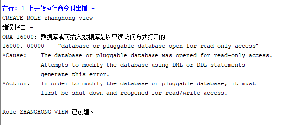
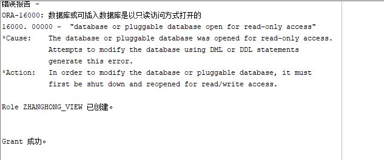
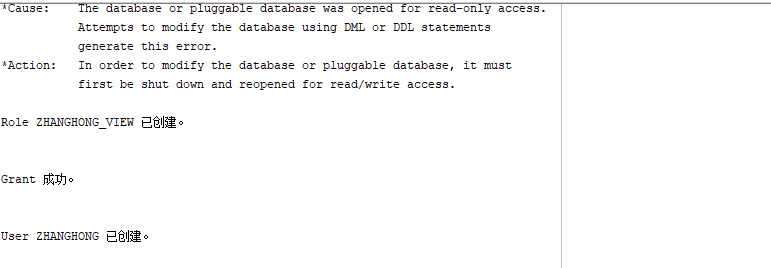
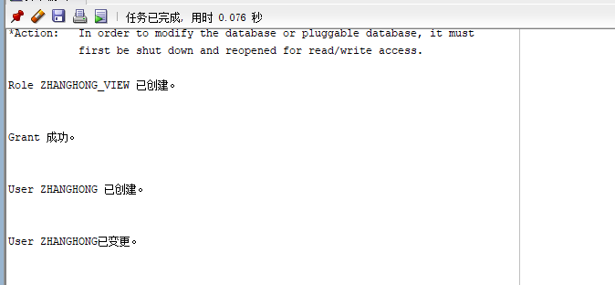
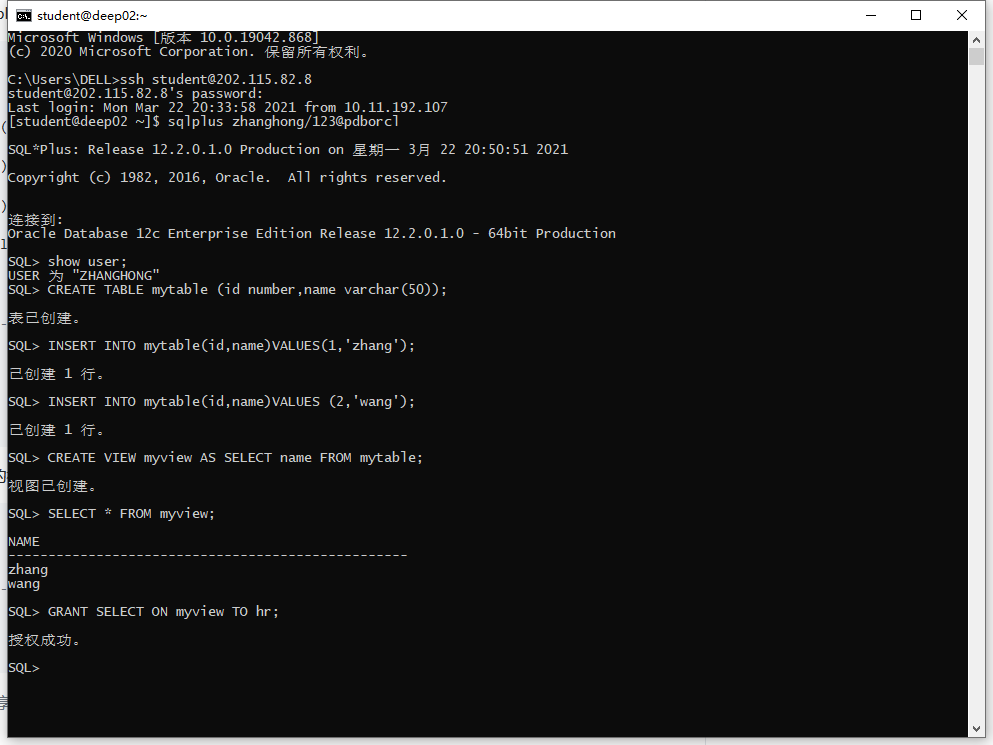
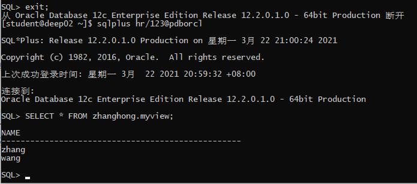
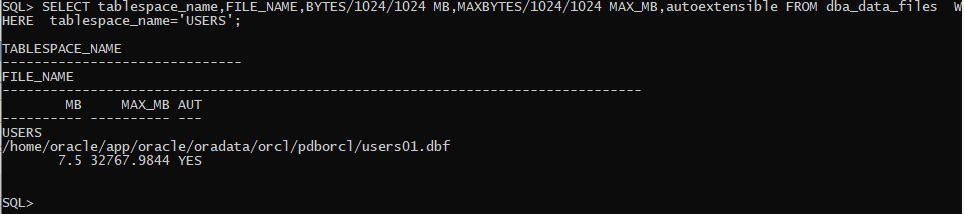
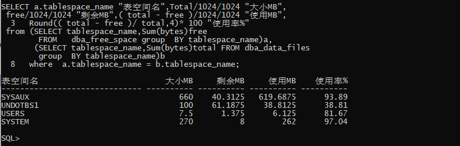

# 实验2：用户及权限管理

## 软件工程3班	201810414326	张洪

## 1. 实验目的

掌握用户管理、角色管理、权根维护与分配的能力，掌握用户之间共享对象的操作技能。

## 2. 实验内容

Oracle有一个开发者角色resource，可以创建表、过程、触发器等对象，但是不能创建视图。本训练要求：

- 在pdborcl插接式数据中创建一个新的本地角色con_res_view，该角色包含connect和resource角色，同时也包含CREATE VIEW权限，这样任何拥有con_res_view的用户就同时拥有这三种权限。
- 创建角色之后，再创建用户new_user，给用户分配表空间，设置限额为50M，授予con_res_view角色。
- 最后测试：用新用户new_user连接数据库、创建表，插入数据，创建视图，查询表和视图的数据。

## 3. 实验步骤

（1）以system登录到pdborcl，创建角色zhanghong_view和用户zhanghong，并授权和分配空间：

```sql
CREATE ROLE zhanghong_view;
```



```sql
GRANT connect,resource,CREATE VIEW TO zhanghong_view;
```



```sql
CREATE USER zhanghong IDENTIFIED BY 123 DEFAULT TABLESPACE users TEMPORARY TABLESPACE temp;
```



```sql
ALTER USER zhanghong QUOTA 50M ON users;
```



```sql
GRANT zhanghong_view TO zhanghong;
```


(2)新用户new_user连接到pdborcl，创建表mytable和视图myview，插入数据，最后将myview的SELECT对象权限授予hr用户。



（3）用户hr连接到pdborcl，查询zhanghong授予它的视图myview。



(4)查看数据库的使用情况：

查看表空间的数据库文件，以及每个文件的磁盘占用情况。





## 4. 实验总结

​		system用户只能用normal身份登陆。除非你对它授予了sysdba的系统权限或者syspoer系统权限。 sys用户具有“SYSDBA”或者“SYSOPER”权限，登陆也只能用这两个身份，不能用normal。sys所有oracle的数据字典的基表和视图都存放在sys用户中，这些基表和视图对于oracle的运行是至关重要的，由数据库自己维护，任何用户都不能手动更改。sys用户拥有dba，sysdba，sysoper等角色或权限，是oracle权限最高的用户。

​		角色是一组权限的集合，将角色赋给一个用户，这个用户就拥有了这个角色中的所有权限。管理角色的方法：

1.建一个角色sql>create role role1;2.授权给角色sql>grant create any table,create procedure to role1;3.授予角色给用户sql>grant role1 to user1;4.查看角色所包含的权限sql>select * from role_sys_privs;5.创建带有口令以角色(在生效带有口令的角色时必须提供口令)sql>create role role1 identified by password1;6.修改角色：是否需要口令sql>alter role role1 not identified;sql>alter role role1 identified by password1;