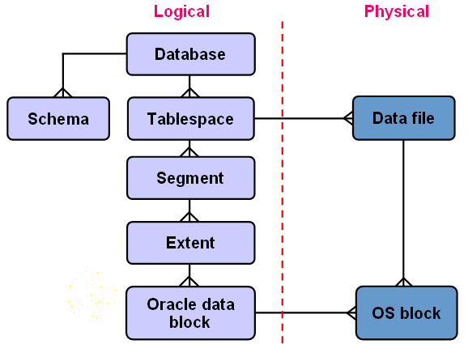

# 实验3：创建分区表

## 软件工程3班	201810414326	张洪

## 1. 实验目的：

掌握分区表的创建方法，掌握各种分区方式的使用场景。

## 2. 实验内容：

1. 本实验使用3个表空间：USERS,USERS02,USERS03。在表空间中创建两张表：订单表(orders)与订单详表(order_details)。
2. 使用你自己的账号创建本实验的表，表创建在上述3个分区，自定义分区策略。
3. 你需要使用system用户给你自己的账号分配上述分区的使用权限。你需要使用system用户给你的用户分配可以查询执行计划的权限。
4. 表创建成功后，插入数据，数据能并平均分布到各个分区。每个表的数据都应该大于1万行，对表进行联合查询。
5. 写出插入数据的语句和查询数据的语句，并分析语句的执行计划。
6. 进行分区与不分区的对比实验。

## 3. 实验步骤：

1. 给用户zhanghong分配权限。


2. 创建表空间zhanghong02和zhanghong03。

```sql
CREATE TABLESPACE zhanghong02 DATAFILE 
'/home/student/pdb/zhanghong/zhanghong02/pdbtest_users02_1.dbf'
 SIZE 100M AUTOEXTEND ON NEXT 50M MAXSIZE UNLIMITED，
'/home/student/pdb/zhanghong/zhanghong02/pdbtest_users02_2.dbf' 
 SIZE 100M AUTOEXTEND ON NEXT 50M MAXSIZE UNLIMITED
EXTENT MANAGEMENT LOCAL SEGMENT SPACE MANAGEMENT AUTO;
```


3.以system身份登录:sqlplus system/123@localhost/pdborcl

```sql
ALTER USER your_user QUOTA UNLIMITED ON USERS;
ALTER USER your_user QUOTA UNLIMITED ON USERS02;
ALTER USER your_user QUOTA UNLIMITED ON USERS03;
```

4.创建order表：

```sql
CREATE TABLE orders 
(
 order_id NUMBER(10, 0) NOT NULL 
 , customer_name VARCHAR2(40 BYTE) NOT NULL 
 , customer_tel VARCHAR2(40 BYTE) NOT NULL 
 , order_date DATE NOT NULL 
 , employee_id NUMBER(6, 0) NOT NULL 
 , discount NUMBER(8, 2) DEFAULT 0 
 , trade_receivable NUMBER(8, 2) DEFAULT 0 
 , CONSTRAINT ORDERS_PK PRIMARY KEY 
  (
    ORDER_ID 
  )
) 
TABLESPACE USERS 
PCTFREE 10 INITRANS 1 
STORAGE (   BUFFER_POOL DEFAULT ) 
NOCOMPRESS NOPARALLEL 

PARTITION BY RANGE (order_date) 
(
 PARTITION PARTITION_BEFORE_2016 VALUES LESS THAN (
 TO_DATE(' 2016-01-01 00:00:00', 'SYYYY-MM-DD HH24:MI:SS', 
 'NLS_CALENDAR=GREGORIAN')) 
 NOLOGGING
 TABLESPACE USERS
 PCTFREE 10 
 INITRANS 1 
 STORAGE 
( 
 INITIAL 8388608 
 NEXT 1048576 
 MINEXTENTS 1 
 MAXEXTENTS UNLIMITED 
 BUFFER_POOL DEFAULT 
) 
NOCOMPRESS NO INMEMORY  
, PARTITION PARTITION_BEFORE_2020 VALUES LESS THAN (
TO_DATE(' 2020-01-01 00:00:00', 'SYYYY-MM-DD HH24:MI:SS', 
'NLS_CALENDAR=GREGORIAN')) 
NOLOGGING 
TABLESPACE USERS
, PARTITION PARTITION_BEFORE_2021 VALUES LESS THAN (
TO_DATE(' 2021-01-01 00:00:00', 'SYYYY-MM-DD HH24:MI:SS', 
'NLS_CALENDAR=GREGORIAN')) 
NOLOGGING 
TABLESPACE USERS02
);
--以后再逐年增加新年份的分区
ALTER TABLE orders ADD PARTITION partition_before_2022
VALUES LESS THAN(TO_DATE('2022-01-01','YYYY-MM-DD'))
TABLESPACE USERS03;
```

5.创建order_details表:

```
CREATE TABLE order_details 
(
id NUMBER(10, 0) NOT NULL 
, order_id NUMBER(10, 0) NOT NULL
, product_id VARCHAR2(40 BYTE) NOT NULL 
, product_num NUMBER(8, 2) NOT NULL 
, product_price NUMBER(8, 2) NOT NULL 
, CONSTRAINT order_details_fk1 FOREIGN KEY  (order_id)
REFERENCES orders  (  order_id   )
ENABLE
) 
TABLESPACE USERS 
PCTFREE 10 INITRANS 1 
STORAGE ( BUFFER_POOL DEFAULT ) 
NOCOMPRESS NOPARALLEL
PARTITION BY REFERENCE (order_details_fk1);
```

6.以自己的账号zhanghong身份登录，并运行脚本文件test3.sql

```shell
cat test3.sql;
sqlplus your_user/123@localhost/pdborcl
```

```sql
@test3.sql
```


7.查看表空间大小

```sql
SELECT tablespace_name,FILE_NAME,BYTES/1024/1024 MB,MAXBYTES/1024/1024 MAX_MB,autoextensible FROM dba_data_files  WHERE  tablespace_name='USERS';
SELECT a.tablespace_name "表空间名",Total/1024/1024 "大小MB",
 free/1024/1024 "剩余MB",( total - free )/1024/1024 "使用MB",
 Round(( total - free )/ total,4)* 100 "使用率%"
 from (SELECT tablespace_name,Sum(bytes)free
        FROM   dba_free_space group  BY tablespace_name)a,
       (SELECT tablespace_name,Sum(bytes)total FROM dba_data_files
        group  BY tablespace_name)b
 where  a.tablespace_name = b.tablespace_name;
```


## 4. 实验总结：

​		我们知道oracle数据库真正存放数据的是数据文件（data files），Oracle表空间（tablespaces）实际上是一个逻辑的概念，他在物理上是并不存在的。一个数据库可以包含多个表空间，一个表空间只能属于一个数据库，一个表空间包含多个数据文件，一个数据文件只能属于一个表空间，表空间可以划分成更细的逻辑存储单元。



分区表： 当表中的数据量不断增大，查询数据的速度就会变慢，应用程序的性能就会下降，这时就应该考虑对表进行分区。表进行分区后，逻辑上表仍然是一张完整的表，只是将表中的数据在物理上存放到多个表空间(物理文件上)，这样查询数据时，不至于每次都扫描整张表。

使用分区表：表的大小超过2GB;表中包含历史数据，新的数据被增加都新的分区中。 	

表分区有以下优点： 改善查询性能：对分区对象的查询可以仅搜索自己关心的分区，提高检索速度; 增强可用性：如果表的某个分区出现故障，表在其他分区的数据仍然可用；维护方便：如果表的某个分区出现故障，需要修复数据，只修复该分区即可；均衡I/O：可以把不同的分区映射到磁盘以平衡I/O，改善整个系统性能。 	