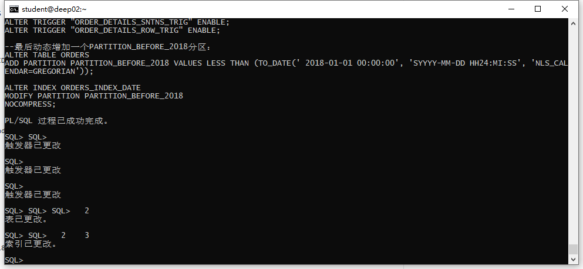
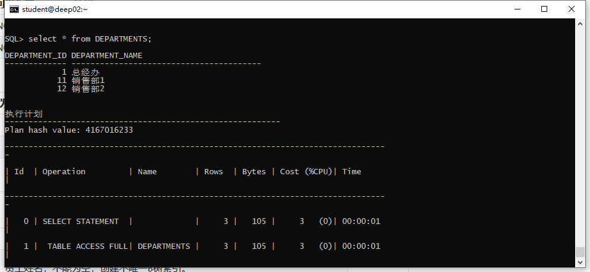
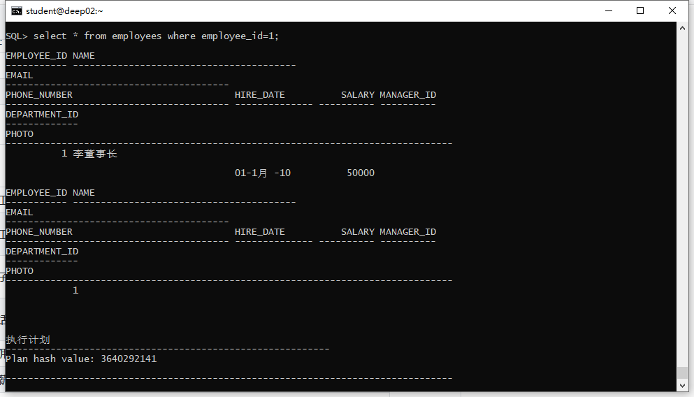
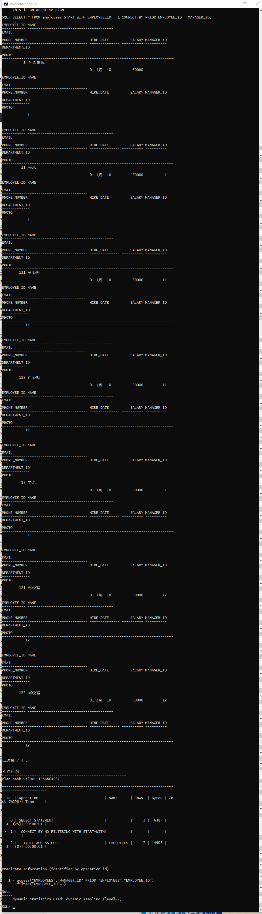
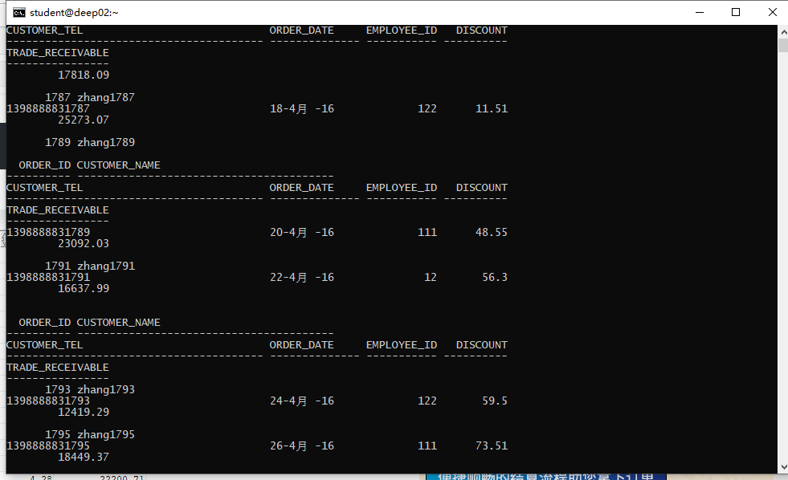
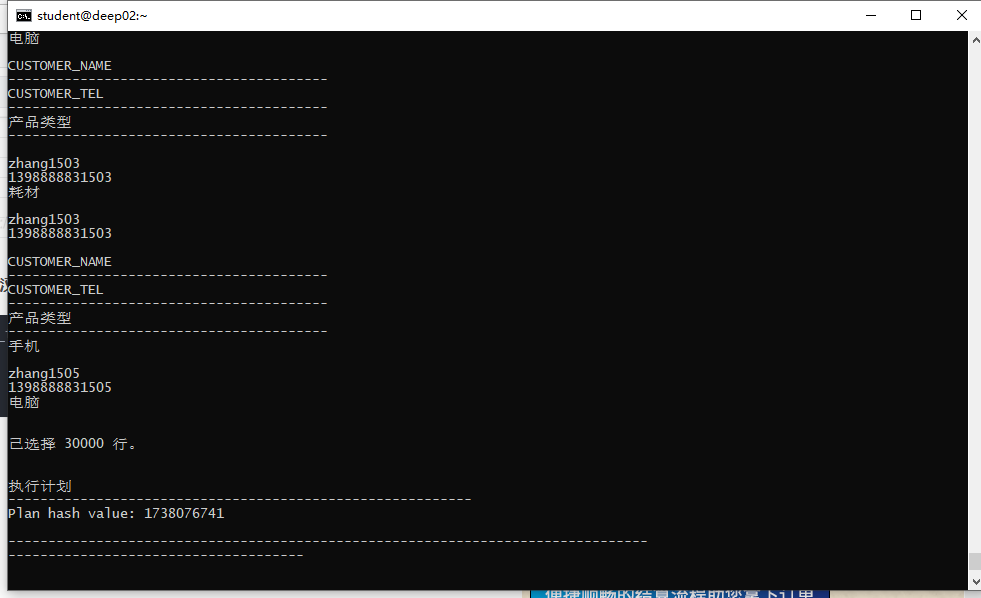
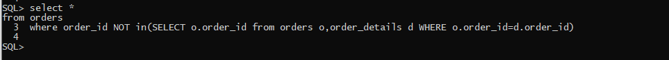
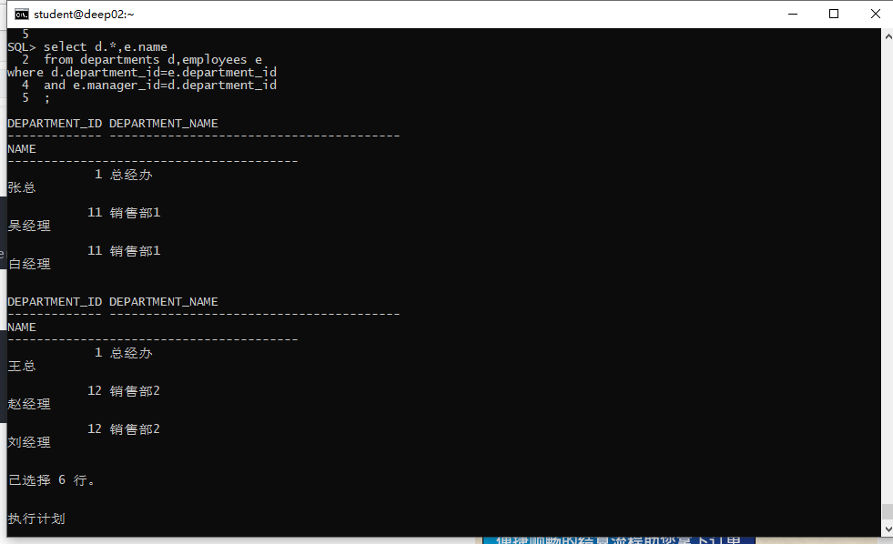
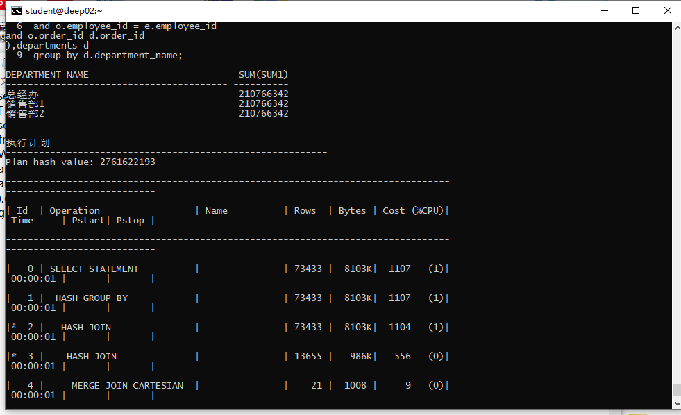

# 实验4：对象管理

### 软件工程3班  201810414326  张洪

## 1. 实验目的：

了解Oracle表和视图的概念，学习使用SQL语句Create Table创建表，学习Select语句插入，修改，删除以及查询数据，学习使用SQL语句创建视图，学习部分存储过程和触发器的使用。

## 2. 实验内容：

假设有一个生产某个产品的单位，单位接受网上订单进行产品的销售。通过实验模拟这个单位的部分信息：员工表，部门表，订单表，订单详单表。

录入数据：

要求至少有1万个订单，每个订单至少有4个详单。至少有两个部门，每个部门至少有1个员工，其中只有一个人没有领导，一个领导至少有一个下属，并且它的下属是另一个人的领导（比如A领导B，B领导C）。

序列的应用：

插入ORDERS和ORDER_DETAILS 两个表的数据时，主键ORDERS.ORDER_ID, ORDER_DETAILS.ID的值必须通过序列SEQ_ORDER_ID和SEQ_ORDER_ID取得，不能手工输入一个数字。

触发器的应用：

维护ORDER_DETAILS的数据时（insert,delete,update）要同步更新ORDERS表订单应收货款ORDERS.Trade_Receivable的值。

查询数据：

1.查询某个员工的信息
2.递归查询某个员工及其所有下属，子下属员工。
3.查询订单表，并且包括订单的订单应收货款: Trade_Receivable= sum(订单详单表.ProductNum*订单详单表.ProductPrice)- Discount。
4.查询订单详表，要求显示订单的客户名称和客户电话，产品类型用汉字描述。
5.查询出所有空订单，即没有订单详单的订单。
6.查询部门表，同时显示部门的负责人姓名。
7.查询部门表，统计每个部门的销售总金额。

## 3. 实验步骤：





查询某个员工信息：

```sql
select * FROM employees WHERE employee_id=1
```



递归查询某个员工及其所有下属，子下属员工:

```sql
SELECT * FROM employees START WITH EMPLOYEE_ID = 1 CONNECT BY PRIOR EMPLOYEE_ID = MANAGER_ID;
```



查询订单表，并且包括订单的订单应收货款: Trade_Receivable= sum(订单详单表.ProductNum*订单详单表.ProductPrice)- Discount:

```sql
select *
FROM orders
```



查询订单详表，要求显示订单的客户名称和客户电话，产品类型用汉字描述:

```sql
select o.customer_name,o.customer_tel, p.product_type AS 产品类型
FROM orders o,order_details d,products p
where o.order_id=d.order_id
and d.product_name=p.product_name
```



查询出所有空订单，即没有订单详单的订单:

```sql
select * 
from orders
where order_id NOT in(SELECT o.order_id from orders o,order_details d WHERE o.order_id=d.order_id)
```



查询部门表，同时显示部门的负责人姓名:

```sql
select d.*,e.name
from departments d,employees e
where d.department_id=e.department_id
and e.manager_id=d.department_id
```



查询部门表，统计每个部门的销售总金额:

```sql
select d.department_name,SUM(sum1)
FROM (
select (d.product_num*d.product_price) sum1
from order_details d,orders o,departments d,employees e
WHERE d.department_id=e.department_id
and o.employee_id = e.employee_id
and o.order_id=d.order_id
),departments d
group by d.department_name

```



## 4. 实验总结：

本次实验学会了如何oracle的表和视图，并复习了一些sql语句的编写。表和视图有如下的区别：

**1、**表是基本存储，视图是把一个或者一些表的数据按照一定规则集合显示。
**2、**视图是已经编译好的sql语句，而表不是。
**3、**表是有实际的物理记录，占用物理空间，视图没有实际的物理记录，不占用物理空间。
**4、**视图是把内容展现的窗口。
**5、**表可以直接对它进行修改，但视图只能用创建的语句来修改。

作用：
**1、**视图因为可以不给用户或者其它开发人员开发看到表结构，安全性可想而知，具有更大的安全性；
**2，**一张或者多张表，之间可能具有比较复杂的联系，我们可以将它们创建成视图，提供出来，这样需要的人就不用每次去理解这其中可能存在的复杂的业务逻辑了，具有更好的简化数据的能力。
**3、**有些库或者整个系统开发完后，这其中各个表无论是结构还是字段含义等都是设计好的。然后要更新或者升级时，发现表设计固定了，如果想要去改的话，很多都要重新设计，增加开发成本的问题，如果创建视图来对表结构的设计进行补充，不就可以大大节约成本，具有对原表设计的一个补充的作用。