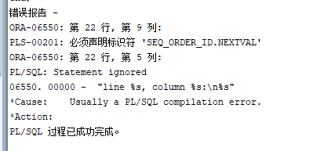

# 基于Oracle的图书商城数据库设计

### 张洪    201810414326    2018级软件工程3班

## 1. 环境搭建

在本地安装Oracle 12C，并创建数据库ZHANG，添加监听器，并启动相应的服务。


## 2. 创建表空间

```sql
-- 创建表空间space1
 CREATE TABLESPACE space1
 datafile
 'H:\app\myoracle\oradata\ZHANG\pdborcl\pdb_01_1.dbf' SIZE 100M AUTOEXTEND ON NEXT 256M maxsize unlimited,
 'H:\app\myoracle\oradata\ZHANG\pdborcl\pdb_01_2.dbf' SIZE 100M AUTOEXTEND ON NEXT 256M maxsize unlimited
 EXTENT MANAGEMENT LOCAL SEGMENT SPACE MANAGEMENT AUTO;
 
 -- 创建表空间space2
 CREATE TABLESPACE space2
 datafile
 'H:\app\myoracle\oradata\ZHANG\pdborcl\pdb_02_1.dbf' SIZE 100M AUTOEXTEND ON NEXT 256M maxsize unlimited,
 'H:\app\myoracle\oradata\ZHANG\pdborcl\pdb_02_2.dbf' SIZE 100M AUTOEXTEND ON NEXT 256M maxsize unlimited
 EXTENT MANAGEMENT LOCAL SEGMENT SPACE MANAGEMENT AUTO;
```


## 3. 创建角色及用户，并进行分配：

创建角色zhang01将connect，resource，create view授权给zhang01。创建用户zhanghong01。分配60M空间给zhanghong01并将角色zhang01授权给用户zhanghong01

```sql
CREATE ROLE zhang01;
 GRANT connect,resource,CREATE VIEW TO zhang01;
 -- 使用space1
 CREATE USER zhanghong01 IDENTIFIED BY 123 DEFAULT TABLESPACE space1 TEMPORARY TABLESPACE temp;
 ALTER USER zhanghong01 QUOTA 60M ON space1;
 GRANT zhang01 TO zhanghong01;
```


创建角色zhang02,将connect，resource，create view授权给zhang02。创建用户zhanghong02，分配60M空间给zhanghong02并将角色zhang02授权给用户zhanghong02：

```sql
CREATE ROLE zhang02;
 GRANT connect,resource,CREATE VIEW TO zhang02;
 CREATE USER zhanghong02 IDENTIFIED BY 123 DEFAULT TABLESPACE space1 TEMPORARY TABLESPACE temp;
 ALTER USER zhanghong02 QUOTA 60M ON space1;
 GRANT zhang02 TO zhanghong02;
```


## 4. 在用户zhanghong01下创建相关的表：

管理员表：ID表示编号，PASSWORD表示密码，ADMIN表示管理员姓名，并添加索引

```sql
CREATE TABLE ADMINISTRATOR 
(
  ID NUMBER(*, 0) NOT NULL 
, PASSWORD VARCHAR2(20 BYTE) NOT NULL 
, ADMIN VARCHAR2(20 BYTE) NOT NULL 
, CONSTRAINT ADMINISTRATOR_PK PRIMARY KEY 
  (
    ID 
  )
  USING INDEX 
  (
      CREATE UNIQUE INDEX ADMINISTRATOR_PK ON ADMINISTRATOR (ID ASC) 
      LOGGING 
      TABLESPACE space1
      PCTFREE 10 
      INITRANS 2 
      STORAGE 
      ( 
        BUFFER_POOL DEFAULT 
      ) 
      NOPARALLEL 
  )
  ENABLE 
) 
LOGGING 
TABLESPACE space1
PCTFREE 10 
INITRANS 1 
STORAGE 
( 
  BUFFER_POOL DEFAULT 
) 
NOCOMPRESS 
NO INMEMORY 
NOPARALLEL;
```

用户表：id表示编号（设为主键），password表示密码，username表示用户名，phone表示联系电话，address表示用户地址，registrationdate表示注册日期，cart_id表示购物车id

```sql
CREATE TABLE BOOKUSER 
(
  ID NUMBER(*, 0) NOT NULL 
, PASSWORD VARCHAR2(20 BYTE) NOT NULL 
, USERNAME VARCHAR2(50 BYTE) NOT NULL 
, PHONE VARCHAR2(20 BYTE) NOT NULL 
, ADDRESS VARCHAR2(30 BYTE) NOT NULL 
, REGISTRATIONDATE DATE NOT NULL 
, CART_ID NUMBER(*, 0) NOT NULL 
, CONSTRAINT U_PK PRIMARY KEY 
  (
    ID 
  )
  USING INDEX 
  (
      CREATE UNIQUE INDEX U_PK ON BOOKUSER (ID ASC) 
      LOGGING 
      TABLESPACE space1 
      PCTFREE 10 
      INITRANS 2 
      STORAGE 
      ( 
        BUFFER_POOL DEFAULT 
      ) 
      NOPARALLEL 
  )
  ENABLE 
) 
TABLESPACE space1
PCTFREE 10 
INITRANS 1 
STORAGE 
( 
  BUFFER_POOL DEFAULT 
) 
NOCOMPRESS 
NOPARALLEL 
PARTITION BY RANGE (REGISTRATIONDATE) 
SUBPARTITION BY RANGE (REGISTRATIONDATE) 
(
  PARTITION DATE2018 VALUES LESS THAN (TO_DATE(' 2018-12-31 00:00:00', 'SYYYY-MM-DD HH24:MI:SS', 'NLS_CALENDAR=GREGORIAN')) 
  TABLESPACE space1
  PCTFREE 10 
  INITRANS 1 
  STORAGE 
  ( 
    BUFFER_POOL DEFAULT 
  ) 
  NOCOMPRESS NO INMEMORY 
  (
    SUBPARTITION DATE2018_3 VALUES LESS THAN (TO_DATE(' 2018-03-31 00:00:00', 'SYYYY-MM-DD HH24:MI:SS', 'NLS_CALENDAR=GREGORIAN')) 
    NOCOMPRESS NO INMEMORY  
  , SUBPARTITION DATE2018_6 VALUES LESS THAN (TO_DATE(' 2018-06-30 00:00:00', 'SYYYY-MM-DD HH24:MI:SS', 'NLS_CALENDAR=GREGORIAN')) 
    NOCOMPRESS NO INMEMORY  
  , SUBPARTITION DATE2018_9 VALUES LESS THAN (TO_DATE(' 2018-09-30 00:00:00', 'SYYYY-MM-DD HH24:MI:SS', 'NLS_CALENDAR=GREGORIAN')) 
    NOCOMPRESS NO INMEMORY  
  , SUBPARTITION DATE2018_12 VALUES LESS THAN (TO_DATE(' 2018-12-31 00:00:00', 'SYYYY-MM-DD HH24:MI:SS', 'NLS_CALENDAR=GREGORIAN')) 
    NOCOMPRESS NO INMEMORY  
  )  
, PARTITION DATE2019 VALUES LESS THAN (TO_DATE(' 2019-12-31 00:00:00', 'SYYYY-MM-DD HH24:MI:SS', 'NLS_CALENDAR=GREGORIAN')) 
  TABLESPACE space1 
  PCTFREE 10 
  INITRANS 1 
  STORAGE 
  ( 
    BUFFER_POOL DEFAULT 
  ) 
  NOCOMPRESS NO INMEMORY 
  (
    SUBPARTITION DATE2019_3 VALUES LESS THAN (TO_DATE(' 2019-03-31 00:00:00', 'SYYYY-MM-DD HH24:MI:SS', 'NLS_CALENDAR=GREGORIAN')) 
    NOCOMPRESS NO INMEMORY  
  , SUBPARTITION DATE2019_6 VALUES LESS THAN (TO_DATE(' 2019-06-30 00:00:00', 'SYYYY-MM-DD HH24:MI:SS', 'NLS_CALENDAR=GREGORIAN')) 
    NOCOMPRESS NO INMEMORY  
  , SUBPARTITION DATE2019_9 VALUES LESS THAN (TO_DATE(' 2019-09-30 00:00:00', 'SYYYY-MM-DD HH24:MI:SS', 'NLS_CALENDAR=GREGORIAN')) 
    NOCOMPRESS NO INMEMORY  
  , SUBPARTITION DATE2019_12 VALUES LESS THAN (TO_DATE(' 2019-12-31 00:00:00', 'SYYYY-MM-DD HH24:MI:SS', 'NLS_CALENDAR=GREGORIAN')) 
    NOCOMPRESS NO INMEMORY  
  )  
);
```

创建商品表：id表示编号（主键），pid表示标识码，booksname表示图书名字，price表示价格，describe表示图书描述，num表示数量，admin_id表示管理员id

```sql
CREATE TABLE COMMODITY 
(
  ID NUMBER(*, 0) NOT NULL 
, PID NUMBER(*, 0) NOT NULL 
, BOOKSNAME VARCHAR2(20 BYTE) NOT NULL 
, PRICE NUMBER NOT NULL 
, DESCRIBE VARCHAR2(50 BYTE) NOT NULL 
, NUM NUMBER(*, 0) NOT NULL 
, ADMIN_ID NUMBER(*, 0) NOT NULL 
, CONSTRAINT COMMODITY_PK PRIMARY KEY 
  (
    ID 
  )
  USING INDEX 
  (
      CREATE UNIQUE INDEX COMMODITY_PK ON COMMODITY (ID ASC) 
      LOGGING 
      TABLESPACE space1
      PCTFREE 10 
      INITRANS 2 
      STORAGE 
      ( 
        BUFFER_POOL DEFAULT 
      ) 
      NOPARALLEL 
  )
  ENABLE 
) 
LOGGING 
TABLESPACE space1
PCTFREE 10 
INITRANS 1 
STORAGE 
( 
  BUFFER_POOL DEFAULT 
) 
NOCOMPRESS 
NO INMEMORY 
NOPARALLEL;
```


创建购物车表：id表示购物车编号（主键），amount表示数量，pid表示标识码，bookuser_id表示用户ID

```sql
CREATE TABLE CART
(
  ID NUMBER(*, 0) NOT NULL 
, AMOUNT NUMBER(*, 0) NOT NULL 
, PID NUMBER(*, 0) NOT NULL 
, BOOKUSER_ID NUMBER(*, 0) NOT NULL 
, CONSTRAINT CART_PK PRIMARY KEY 
  (
    ID 
  )
  USING INDEX 
  (
      CREATE UNIQUE INDEX CART_PK ON CART (ID ASC) 
      LOGGING 
      TABLESPACE space1
      PCTFREE 10 
      INITRANS 2 
      STORAGE 
      ( 
        BUFFER_POOL DEFAULT 
      ) 
      NOPARALLEL 
  )
  ENABLE 
, CONSTRAINT CART_BOOKUSER FOREIGN KEY
  (
  BOOKUSER_ID 
  )
  REFERENCES BOOKUSER
  (
  ID 
  )
  ENABLE 
) 
PCTFREE 10 
PCTUSED 40 
INITRANS 1 
STORAGE 
( 
  BUFFER_POOL DEFAULT 
) 
NOCOMPRESS 
NOPARALLEL 
PARTITION BY REFERENCE (CART_BOOKUSER) 
(
  PARTITION DATE2018_3 
  LOGGING 
  TABLESPACE space1
  PCTFREE 10 
  INITRANS 1 
  STORAGE 
  ( 
    BUFFER_POOL DEFAULT 
  ) 
  NOCOMPRESS NO INMEMORY  
, PARTITION DATE2018_6 
  LOGGING 
  TABLESPACE space1
  PCTFREE 10 
  INITRANS 1 
  STORAGE 
  ( 
    BUFFER_POOL DEFAULT 
  ) 
  NOCOMPRESS NO INMEMORY  
, PARTITION DATE2018_9 
  LOGGING 
  TABLESPACE space1
  PCTFREE 10 
  INITRANS 1 
  STORAGE 
  ( 
    BUFFER_POOL DEFAULT 
  ) 
  NOCOMPRESS NO INMEMORY  
, PARTITION DATE2018_12 
  LOGGING 
  TABLESPACE space1
  PCTFREE 10 
  INITRANS 1 
  STORAGE 
  ( 
    BUFFER_POOL DEFAULT 
  ) 
  NOCOMPRESS NO INMEMORY  
, PARTITION DATE2019_3 
  LOGGING 
  TABLESPACE space1
  PCTFREE 10 
  INITRANS 1 
  STORAGE 
  ( 
    BUFFER_POOL DEFAULT 
  ) 
  NOCOMPRESS NO INMEMORY  
, PARTITION DATE2019_6 
  LOGGING 
  TABLESPACE space1
  PCTFREE 10 
  INITRANS 1 
  STORAGE 
  ( 
    BUFFER_POOL DEFAULT 
  ) 
  NOCOMPRESS NO INMEMORY  
, PARTITION DATE2019_9 
  LOGGING 
  TABLESPACE space1
  PCTFREE 10 
  INITRANS 1 
  STORAGE 
  ( 
    BUFFER_POOL DEFAULT 
  ) 
  NOCOMPRESS NO INMEMORY  
, PARTITION DATE2019_12 
  LOGGING 
  TABLESPACE space1
  PCTFREE 10 
  INITRANS 1 
  STORAGE 
  ( 
    BUFFER_POOL DEFAULT 
  ) 
  NOCOMPRESS NO INMEMORY  
);
```

创建论坛表：id表示编号，content表示编号

```sql
CREATE TABLE TABLE1 
(
  ID INT NOT NULL 
, CONTENT NVARCHAR2(50) NOT NULL 
, CONSTRAINT TABLE1_PK PRIMARY KEY 
  (
    ID 
  )
  ENABLE 
);
```


更改用户zhanghong01的空间大小：

```sql
ALTER USER zhanghong01 QUOTA 90M ON space1;
```


## 5. 批量插入六万多条数据：

```sql
declare
  id number(38,0);
  username varchar2(50);
  phone varchar2(20);
  address varchar2(30);
  REGISTRATIONDATE date;
  booksname varchar2(50);
  price number(5,2);
  num number(38,0);
  amount number(38,0);
  
begin
  for i in 1..20000
  loop
    if i mod 2 =0 then
      REGISTRATIONDATE:=to_date('2018-5-6','yyyy-mm-dd')+(i mod 60);
    else
      REGISTRATIONDATE:=to_date('2019-5-6','yyyy-mm-dd')+(i mod 60);
    end if;

    --插入用户
    id:=i;
    username := 'aa'|| 'aa';
    username := 'wang' || i;
    phone := '131785693' || i;
	booksname := '数据库原理' || i;
	address :='成都'|| '四川';
	price :=(dbms_random.value() * 100);
	num :=(i mod 5);
    insert /*+append*/ into bookuser (id,password,username,phone,address,REGISTRATIONDATE,cart_id)
      values (id,username,username,phone,address,REGISTRATIONDATE,id);
	--插入货品
		
	insert into commodity(id,pid,booksname,price,describe,num,admin_id)
		values (id,id,booksname,price,'good',num,1);
	--插入购物车
	amount :=(id mod 3 ) + 1;
	insert into cart(id,amount,pid,bookuser_id)
	 	values (id,amount,id,id);

    IF I MOD 1000 =0 THEN
      commit; --每次提交会加快插入数据的速度
    END IF;
  end loop;
end;
```



查看bookuser表，数据已存在：


## 6. 创建程序包及存储过程并进行执行计划分析

```sql
create or replace PACKAGE book_package Is
   function getcartsumprice(user_id number) return number;
   procedure adduser(password varchar2,username varchar2,phone varchar2,address varchar2,registerdate VARCHAR2);
end book_package;
create or replace PACKAGE body book_package Is
       function getcartsumprice(user_id number) return number as
          begin
            declare cart_sum number;
			query_sql varchar2(200);
            begin
			query_sql:='select sum(pricesum) from view_SinglePriceSum where ID=' || user_id;
              execute immediate query_sql into cart_sum;
			  return cart_sum;
            end;
          end;
                  procedure addUser(password varchar2,username varchar2,phone varchar2,address varchar2,registerdate varchar2) as
            begin
              declare maxId number;
              begin
                select max(id) into maxId from bookuser;
                insert into bookuser values(maxId+1,password,username,phone,address,to_date(registerdate,'yyyy-mm-dd'),maxId+1);
                commit;
              end;
            end;
end;
```


使用自定义函数getcartsumprice（）查询id号为6666的用户购物车商品总价

```sql
select BOOK_PACKAGE.getcartsumprice(6666) from dual;
```


使用存储过程adduser插入用户数据:

```sql
select BOOK_PACKAGE.getcartsumprice(6666) from dual;
set serveroutput on
declare
begin
BOOK_PACKAGE.addUser('131','cwd','125626','hongkong','2019-05-02');
end;
```


执行计划分析:

```sql
select * from BOOKUSER b,COMMODITY co,CART ca where b.id=ca.BOOKUSER_ID and ca.PID=co.PID and
b.REGISTRATIONDATE between to_date('2018-1-1','yyyy-mm-dd') and to_date('2018-6-1','yyyy-mm-dd');
```

查看表空间使用情况：

```sql
SELECT SUM(bytes) / (1024 * 1024) AS free_space, tablespace_name
FROM dba_free_space
GROUP BY tablespace_name;
SELECT a.tablespace_name,
a.bytes total,
b.bytes used,
c.bytes free,
(b.bytes * 100) / a.bytes "% USED ",
(c.bytes * 100) / a.bytes "% FREE "
FROM sys.sm$ts_avail a, sys.sm$ts_used b, sys.sm$ts_free c
WHERE a.tablespace_name = b.tablespace_name
AND a.tablespace_name = c.tablespace_name;
```


## 7. 备份

```sql
-- 数据备份
create directory dpdata1 as 'H:\dataTemp';
select * from dba_directories;
-- 开始备份
-- 授权给用户
grant read,write on directory dpdata1 to zhanghong01;
```


```shell
expdp system/Zhang123@ZHANG directory=dpdata1 dumpfile=beifen.dmp logfile=beifen.log schemas=zhanghong01
```


